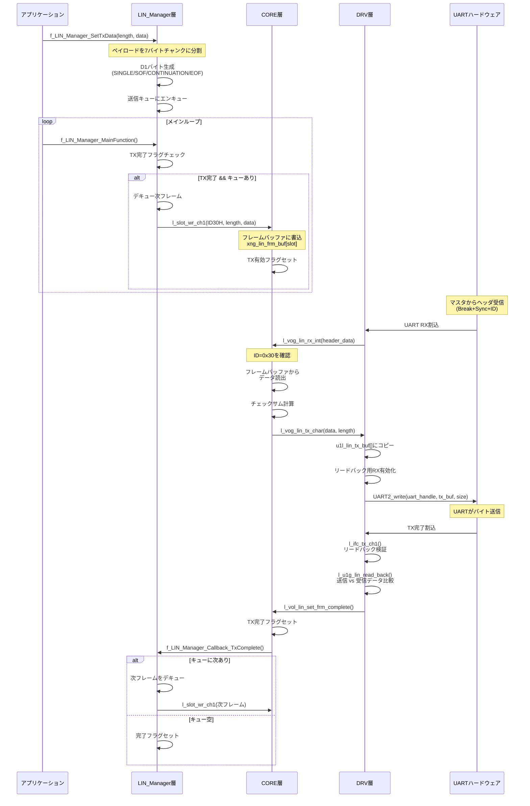
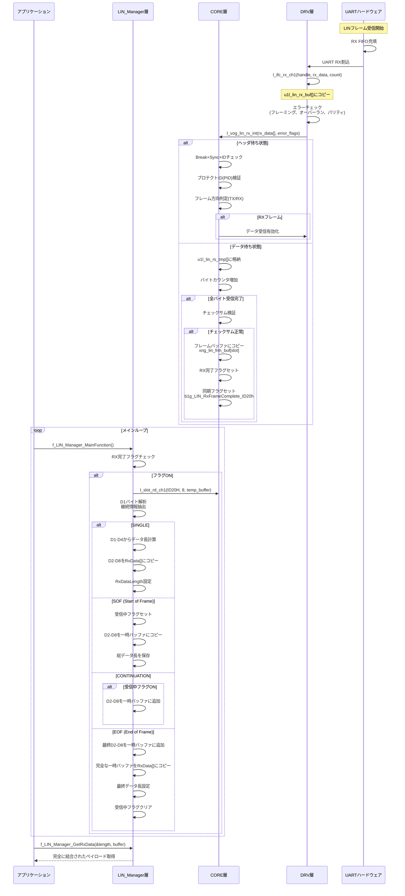
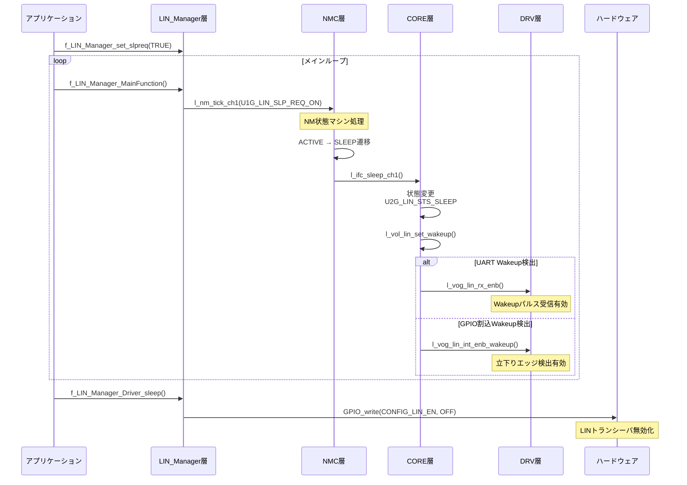
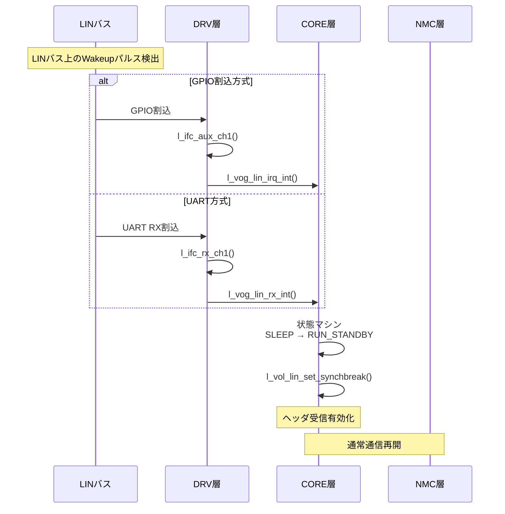
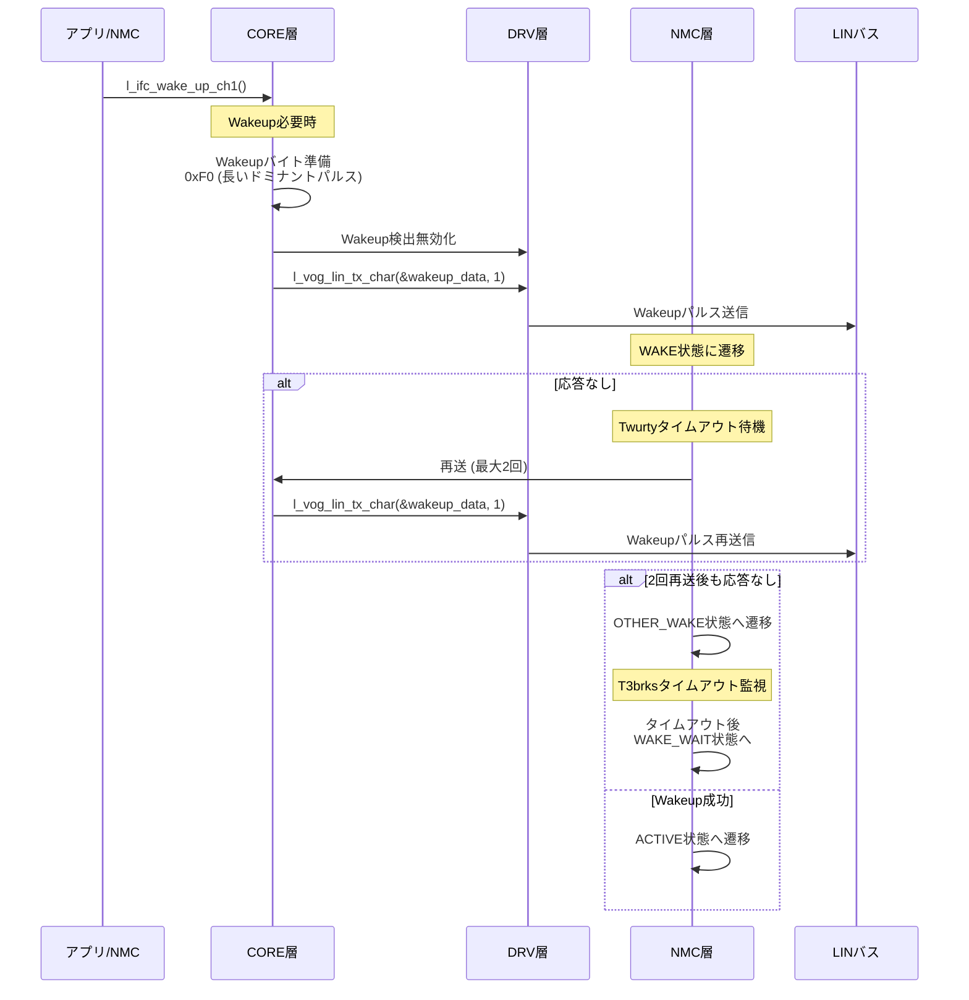
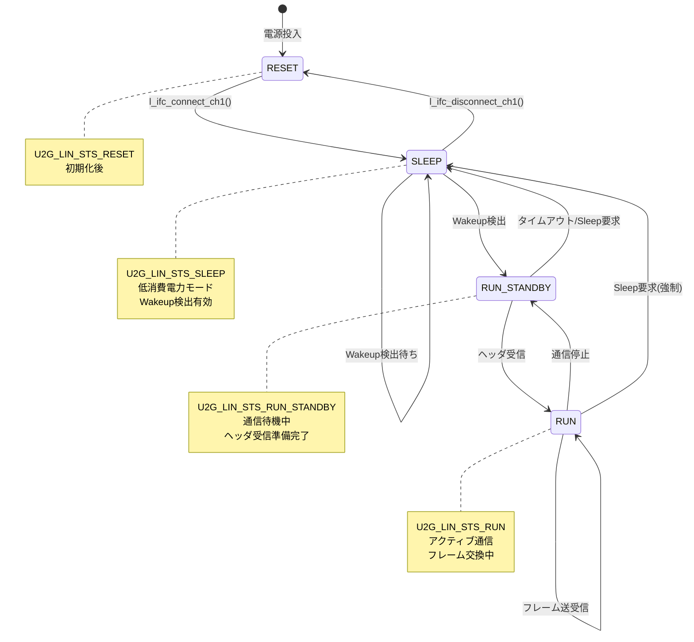
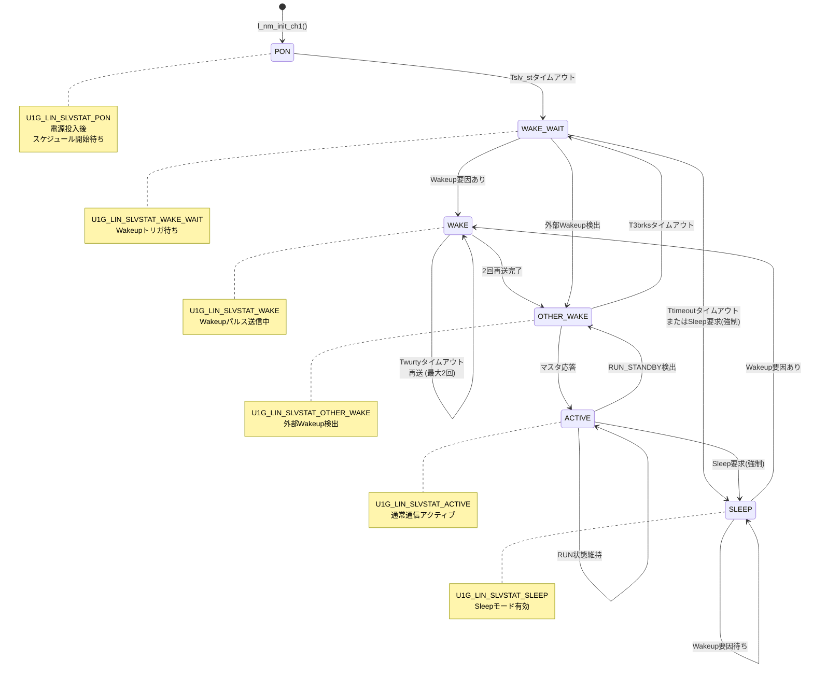

# LIN_Soft - LIN通信スタック実装

## 概要

Texas Instruments CC2340R53マイコン向けの完全なLIN（Local Interconnect Network）通信スタック実装です。このスタックはSLIN（Slave LIN）プロトコルを多層アーキテクチャで実装し、フレーム分割・結合機能とネットワーク管理機能を備えた堅牢なLIN通信機能を提供します

## アーキテクチャ

LIN通信スタックは階層的な多層アーキテクチャで構成されています：

```
┌─────────────────────────────────────────────────────────────┐
│  アプリケーション層                                         │
│  (ユーザーアプリケーションコード)                           │
└─────────────────────────────────────────────────────────────┘
                            ↓
┌─────────────────────────────────────────────────────────────┐
│  LIN_Manager層 (LIN_Manager.c/h)                            │
│  - 複数フレームペイロードの組立・分解                       │
│  - フレーム分割 (Single/SOF/CONTINUATION/EOF)               │
│  - 送信キュー管理 (最大10フレーム)                          │
└─────────────────────────────────────────────────────────────┘
                            ↓
┌─────────────────────────────────────────────────────────────┐
│  SLIN API層 (l_slin_api.h)                                  │
│  - フレームID定義 (0x20, 0x30, 0x33, 0x34, 0x2D)            │
│  - シグナルマッピングとスロット管理                         │
│  - 標準LIN API関数                                          │
└─────────────────────────────────────────────────────────────┘
                            ↓
┌─────────────────────────────────────────────────────────────┐
│  SLIN CORE層 (l_slin_core_cc2340r53.c/h)                   │
│  - LINプロトコル状態マシン                                  │
│  - フレーム送受信ロジック                                   │
│  - チェックサム計算                                         │
│  - エラーハンドリングと状態管理                             │
└─────────────────────────────────────────────────────────────┘
                            ↓
┌─────────────────────────────────────────────────────────────┐
│  SLIN DRV層 (l_slin_drv_cc2340r53.c/h)                     │
│  - UARTハードウェアインターフェース                         │
│  - 割り込みハンドラ (RX, TX, Timer, Wakeup)                │
│  - レジスタレベル操作                                       │
└─────────────────────────────────────────────────────────────┘
                            ↓
┌─────────────────────────────────────────────────────────────┐
│  TI UART2ドライバ (外部)                                    │
│  - UART2LPF3ハードウェア抽象化                              │
└─────────────────────────────────────────────────────────────┘
```

## ファイル構造

### Manager層
- **LIN_Manager.c** (582行)
  - フレーム分割と結合
  - 送信フレームのキュー管理
  - TX/RX完了コールバックハンドラ
  - スリープ要求管理

- **LIN_Manager.h**
  - アプリケーション層向けパブリックAPI
  - 最大ペイロードサイズ: 307バイト
  - フレーム定数と型定義

### API層
- **l_slin_api.h**
  - LINフレームID定義
  - シグナルマッピングマクロ
  - API関数プロトタイプ
  - グローバルフラグ定義 (TX/RX完了)

### CORE層
- **l_slin_core_cc2340r53.c** (1180行)
  - LIN状態マシン実装
  - フレームTX/RX処理
  - チェックサム検証
  - ステータスバッファ管理

- **l_slin_core_cc2340r53.h**
  - CORE層関数プロトタイプ
  - 状態定義
  - 内部データ構造

### DRV層
- **l_slin_drv_cc2340r53.c** (485行)
  - UARTの初期化と設定
  - 割り込みハンドラ:
    - `l_ifc_rx_ch1()` - UART RXコールバック
    - `l_ifc_tx_ch1()` - UART TXコールバック
    - `l_ifc_aux_ch1()` - GPIO外部割り込み (Wakeup検出)
    - `l_ifc_tm_ch1()` - タイマ割り込み (タイムアウト検出)
  - ハードウェアレジスタアクセス
  - リードバック検証

- **l_slin_drv_cc2340r53.h**
  - DRV層関数プロトタイプ
  - ハードウェア設定パラメータ

- **l_slin_sfr_cc2340r53.h**
  - 特殊機能レジスタ(SFR)定義
  - UARTレジスタアドレス
  - ビットマスク定義

### ネットワーク管理層
- **l_slin_nmc.c** (359行)
  - ネットワーク管理コンポーネント(NMC)
  - Sleep/Wakeup状態マシン
  - マスタノード監視
  - タイムアウト管理

- **l_slin_nmc.h**
  - NMC関数プロトタイプ
  - スレーブ状態定義

### テーブル管理
- **l_slin_tbl.c** (110行)
  - ID情報テーブル (64フレームID)
  - スロット情報テーブル (5スロット)
  - プロテクトIDテーブル
  - フラグセット/クリアテーブル
  - グローバルバッファ定義

- **l_slin_tbl.h**
  - テーブル構造定義
  - バッファ宣言

### 共通ユーティリティ
- **l_slin_cmn.c** (48行)
  - 共通ユーティリティ関数
  - テーブルチェック関数

- **l_slin_cmn.h**
  - 共通関数プロトタイプ

### 型定義と定数
- **l_type.h**
  - 基本型定義: `l_u8`, `l_u16`, `l_u32`, `l_bool`
  - 標準C型へのマッピング

- **l_stddef.h**
  - 標準定義 (NULLなど)

- **l_limit.h**
  - システム制限値

- **l_slin_def.h**
  - SLIN固有定数
  - 設定パラメータ

## LINフレーム構造

### フレームフォーマット

```
┌──────────┬──────────┬──────────┬─────┬──────────┬────────────┐
│  ヘッダ  │    D1    │    D2    │ ... │    D8    │チェックサム│
│(マスタ)  │(制御)    │(データ)  │     │(データ)  │ (1バイト)  │
└──────────┴──────────┴──────────┴─────┴──────────┴────────────┘
```

### D1バイト構造 (フレーム制御)

```
Bit 7-6: Sleep.ind / Wakeup.ind
  00 = 通常動作
  01 = Wakeup表示
  10 = Sleep表示
  11 = 予約

Bit 5: Data.ind (データ表示)
  0 = データ更新なし
  1 = データ更新あり

Bit 4-3: 機能別識別情報
  00 = NFC機能
  01 = 予約
  10 = 予約
  11 = 予約

Bit 2-0: フレーム継続情報
  000 = SINGLE (単発フレーム, データ長 ≤ 7バイト)
  001 = SOF (Start of Frame, 複数フレーム開始)
  010 = CONTINUATION (継続フレーム)
  011 = EOF (End of Frame, 複数フレーム終了)
```

## フレームIDと用途

| フレームID | 方向 | データ長 | 用途 |
|-----------|------|----------|------|
| 0x20 | RX | 8バイト | 外部デバイスからアプリケーションへのデータ受信 |
| 0x30 | TX | 8バイト | アプリケーションから外部デバイスへのデータ送信 |
| 0x33 | RX | 8バイト | BLEアンテナテスト要求 |
| 0x34 | TX | 8バイト | BLEアンテナテスト応答 |
| 0x2D | TX | 8バイト | ネットワーク管理フレーム |

## 通信フロー

### 1. フレーム送信フロー



### 2. フレーム受信フロー



### 3. Sleep/Wakeupフロー

#### Sleepリクエストフロー



#### Wakeup検出フロー



#### Wakeup送信フロー



### 4. 状態マシン図

#### LINバス状態遷移



#### NMスレーブ状態遷移



## 主要データ構造

### フレームバッファ (`xng_lin_frm_buf[]`)

```c
typedef struct {
    union {
        struct {
            l_u16 u2g_lin_no_use     : 1;  // スロット無効フラグ
            l_u16 u2g_lin_err_par    : 1;  // パリティエラー
            l_u16 u2g_lin_err_fram   : 1;  // フレーミングエラー
            l_u16 u2g_lin_err_overrun: 1;  // オーバーランエラー
            l_u16 u2g_lin_err_chksum : 1;  // チェックサムエラー
            // ... 追加エラーフラグ
        } st_bit;
        l_u16 u2g_lin_word;
    } un_state;

    union {
        l_u8 u1g_lin_byte[8];  // 8データバイト
        l_u64 u8g_lin_dword;   // 64ビットアクセス
    } xng_lin_data;
} st_lin_buf_type;

st_lin_buf_type xng_lin_frm_buf[U1G_LIN_MAX_SLOT];  // 5スロット
```

### ステータスバッファ (`xng_lin_sts_buf`)

```c
typedef struct {
    union {
        struct {
            l_u16 u2g_lin_sts;         // LIN状態
            l_u16 u2g_lin_nad;         // ノードアドレス (NAD)
            l_u16 u2g_lin_phy_bus_err; // 物理バスエラー
        } st_bit;
        struct {
            l_u16 u2g_lin_e_head;      // ヘッダエラー
            l_u16 u2g_lin_e_resp;      // 応答エラー
        } st_err;
    } un_state;

    union {
        l_u16 u2g_lin_word;
    } un_rs_flg1, un_rs_flg2, un_rs_flg3, un_rs_flg4;  // 完了フラグ
} st_lin_state_type;
```

### スロット情報テーブル

```c
typedef struct {
    l_u8  u1g_lin_id;           // フレームID
    l_u8  u1g_lin_dl;           // データ長
    l_u8  u1g_lin_cmd;          // コマンド (RCV/SND)
    l_u8  u1g_lin_nm;           // NMフレームフラグ
    l_u8  u1g_lin_def[8];       // デフォルトデータ値
    l_u8  u1g_lin_err[8];       // エラーデータ値
} st_lin_slot_info_type;

const st_lin_slot_info_type xng_lin_slot_tbl[U1G_LIN_MAX_SLOT];
```

## 重要なグローバルフラグ

### 同期フラグ (l_slin_api.hで定義)

```c
extern l_u8 b1g_LIN_RxFrameComplete_ID20h;  // RXフレーム0x20完了
extern l_u8 b1g_LIN_TxFrameComplete_ID30h;  // TXフレーム0x30完了
```

**使用パターン:**

```c
// 受信チェック (メインループ内)
l_u1g_lin_irq_dis();
if (b1g_LIN_RxFrameComplete_ID20h == U1G_DAT_BIT_ON) {
    b1g_LIN_RxFrameComplete_ID20h = U1G_DAT_BIT_OFF;
    l_slot_rd_ch1(U1G_LIN_FRAME_ID20H, 8, buffer);
    // 受信データ処理
}
l_vog_lin_irq_res();

// 送信チェック (メインループ内)
l_u1g_lin_irq_dis();
if (b1g_LIN_TxFrameComplete_ID30h == U1G_DAT_TRUE) {
    b1g_LIN_TxFrameComplete_ID30h = U1G_DAT_FALSE;
    l_slot_wr_ch1(U1G_LIN_FRAME_ID30H, 8, data);
    // フレーム送信キュー登録
}
l_vog_lin_irq_res();
```

## 割り込みハンドラ

### 1. UART RX割り込み (`l_ifc_rx_ch1`)
- **トリガ:** UART完全データ受信
- **処理:**
  - UARTバッファから受信バイトコピー
  - エラーチェック (フレーミング、オーバーラン、パリティ)
  - データとエラーステータスで`l_vog_lin_rx_int()`呼出

### 2. UART TX割り込み (`l_ifc_tx_ch1`)
- **トリガ:** UART送信完了
- **処理:**
  - リードバック検証
  - TX完了フラグセット
  - キュー内次フレーム送信トリガ

### 3. タイマ割り込み (`l_ifc_tm_ch1`)
- **トリガ:** LGPTimerタイムアウト
- **処理:**
  - `l_vog_lin_tm_int()`呼出
  - ヘッダタイムアウト検出
  - タイムアウトエラーフラグセット

### 4. 外部GPIO割り込み (`l_ifc_aux_ch1`)
- **トリガ:** LIN RXピン上のWakeupパルス
- **処理:**
  - `l_vog_lin_irq_int()`呼出
  - Wakeup検出
  - SLEEPからRUN_STANDBYへ状態遷移

## クリティカルセクション

### 割り込み保護マクロ

```c
l_u1g_lin_irq_dis();  // 割り込み禁止 (ネスト対応)
// ... クリティカルセクションコード ...
l_vog_lin_irq_res();  // 割り込み復元 (ネスト対応)
```

**使用タイミング:**
- 同期フラグの読書時
- 共有フレームバッファアクセス時
- 状態変数変更時

## エラーハンドリング

### エラー種別

1. **ヘッダエラー** (`u2g_lin_e_head`に格納)
   - Syncフィールドエラー
   - PIDパリティエラー
   - ヘッダタイムアウト

2. **応答エラー** (フレームバッファに格納)
   - フレーミングエラー (`u2g_lin_err_fram`)
   - パリティエラー (`u2g_lin_err_par`)
   - チェックサムエラー (`u2g_lin_err_chksum`)
   - オーバーランエラー (`u2g_lin_err_overrun`)

3. **物理バスエラー**
   - 連続ヘッダタイムアウトエラー
   - カウンタ閾値: `U1G_LIN_CNT_MSTERR`
   - マスタ故障の可能性を示唆

### エラー回復

- エラーはステータスバッファに記録
- アプリケーションは`l_ifc_read_status_ch1()`経由でステータス読取可能
- 読取後にステータスフラグクリア
- マスタ監視用の物理バスエラー検出

## タイミングパラメータ

### NMタイムアウト (l_slin_nmc.cで定義)

- **Tslv_st:** 電源投入後のスレーブ起動時間
- **Twurty:** Wakeup再送間隔
- **T3brks:** 3ブレークフィールド待機時間 (外部Wakeup)
- **Ttimeout:** 状態遷移用汎用タイムアウト
- **Tdata:** データ表示タイムアウト

### 再送カウンタ

- **U2G_LIN_CNT_RETRY:** Wakeup送信最大再送回数 (2)
- **U1G_LIN_CNT_MSTERR:** マスタエラー検出閾値

## 設定

### ボーレート選択 (l_slin_def.h)

```c
#define U1G_LIN_BAUDRATE_2400   (0)
#define U1G_LIN_BAUDRATE_9600   (1)
#define U1G_LIN_BAUDRATE_19200  (2)

#define U1G_LIN_BAUDRATE  U1G_LIN_BAUDRATE_19200  // 現在の選択
```

### Wakeup検出方式

```c
#define U1G_LIN_WP_UART_USE  (0)  // UARTベースWakeup検出
#define U1G_LIN_WP_INT_USE   (1)  // GPIO割込ベース検出

#define U1G_LIN_WAKEUP  U1G_LIN_WP_INT_USE  // 現在の選択
```

### チェックサムタイプ

```c
typedef enum {
    U1G_LIN_CHECKSUM_CLASSIC  = 0,  // クラシックチェックサム (データのみ)
    U1G_LIN_CHECKSUM_ENHANCED = 1   // 拡張チェックサム (PID + データ)
} U1G_LIN_ChecksumType;
```

## 使用例

### 初期化

```c
// LIN Managerを初期化
f_LIN_Manager_Initialize();
// 内部的に以下を呼出:
//   l_sys_init()
//   l_ifc_init_ch1()
//   l_nm_init_ch1()
//   l_ifc_connect_ch1()
```

### データ送信

```c
u1 payload[20] = { /* データ */ };
u2 length = 20;

// LIN_Managerが自動的に複数フレームに分割
f_LIN_Manager_SetTxData(length, payload);

// メインループで定期的に呼出:
f_LIN_Manager_MainFunction();
```

### データ受信

```c
u1 rx_buffer[307];  // 最大ペイロードサイズ
u2 rx_length;

// メインループ内:
f_LIN_Manager_MainFunction();

// 受信データチェック:
f_LIN_Manager_GetRxData(&rx_length, rx_buffer);
if (rx_length > 0) {
    // 受信データ処理
}
```

### Sleep/Wakeup制御

```c
// Sleepリクエスト
f_LIN_Manager_set_slpreq(U1G_DAT_TRUE);
f_LIN_Manager_Driver_sleep();  // LINトランシーバ無効化

// Sleepリクエストキャンセル (Wakeupトリガ)
f_LIN_Manager_set_slpreq(U1G_DAT_FALSE);

// ネットワーク管理が以下で処理:
f_LIN_Manager_MainFunction();
```

## 層別関数リファレンス

### Manager層 (LIN_Manager.c)

| 関数 | 目的 |
|------|------|
| `f_LIN_Manager_Initialize()` | LINスタック全体の初期化 |
| `f_LIN_Manager_MainFunction()` | 定期処理 (メインループで呼出) |
| `f_LIN_Manager_SetTxData()` | 送信データをキューイング |
| `f_LIN_Manager_GetRxData()` | 受信データ取得 |
| `f_LIN_Manager_set_slpreq()` | Sleepリクエストフラグ設定 |
| `f_LIN_Manager_Driver_sleep()` | LINトランシーバ無効化 |
| `f_LIN_Manager_Callback_TxComplete()` | 内部TX完了コールバック |

### API/CORE層 (l_slin_core_cc2340r53.c)

| 関数 | 目的 |
|------|------|
| `l_sys_init()` | システム初期化 |
| `l_ifc_init_ch1()` | インターフェース初期化 |
| `l_ifc_connect_ch1()` | LINバス接続 |
| `l_ifc_disconnect_ch1()` | LINバス切断 |
| `l_ifc_wake_up_ch1()` | Wakeupパルス送信 |
| `l_ifc_sleep_ch1()` | Sleepモード移行 |
| `l_ifc_run_ch1()` | Runモード移行 |
| `l_ifc_read_status_ch1()` | バスステータス読取 |
| `l_ifc_read_lb_status_ch1()` | LIN状態読取 |
| `l_slot_enable_ch1()` | フレームスロット有効化 |
| `l_slot_disable_ch1()` | フレームスロット無効化 |
| `l_slot_rd_ch1()` | フレームデータ読取 |
| `l_slot_wr_ch1()` | フレームデータ書込 |
| `l_vog_lin_rx_int()` | RX割り込みハンドラ |
| `l_vog_lin_tm_int()` | タイマ割り込みハンドラ |
| `l_vog_lin_irq_int()` | 外部割り込みハンドラ |
| `l_vog_lin_checksum()` | LINチェックサム計算 |

### DRV層 (l_slin_drv_cc2340r53.c)

| 関数 | 目的 |
|------|------|
| `l_vog_lin_uart_init()` | UARTハードウェア初期化 |
| `l_vog_lin_int_init()` | GPIO割込初期化 |
| `l_vog_lin_rx_enb()` | UART受信有効化 |
| `l_vog_lin_rx_dis()` | UART受信無効化 |
| `l_vog_lin_int_enb()` | GPIO割込有効化 (立上りエッジ) |
| `l_vog_lin_int_enb_wakeup()` | Wakeup割込有効化 (立下りエッジ) |
| `l_vog_lin_int_dis()` | GPIO割込無効化 |
| `l_vog_lin_tx_char()` | UART経由データ送信 |
| `l_u1g_lin_read_back()` | 送信データ検証 |
| `l_ifc_rx_ch1()` | UART RXコールバック (UART2ドライバから) |
| `l_ifc_tx_ch1()` | UART TXコールバック (UART2ドライバから) |
| `l_ifc_aux_ch1()` | GPIO割込コールバック |
| `l_ifc_tm_ch1()` | タイマ割込コールバック |

### NMC層 (l_slin_nmc.c)

| 関数 | 目的 |
|------|------|
| `l_nm_init_ch1()` | ネットワーク管理初期化 |
| `l_nm_tick_ch1()` | NMティック処理 (定期呼出) |
| `l_nm_rd_slv_stat_ch1()` | スレーブ状態読取 |
| `l_nm_rd_mst_err_ch1()` | マスタエラーフラグ読取 |
| `l_nm_clr_mst_err_ch1()` | マスタエラーフラグクリア |

## 重要な注意事項

### ベンダーコード制限

以下のファイルは**"編集禁止"**マークあり:
- `l_slin_api.h`
- `l_slin_core_cc2340r53.c/h`
- `l_slin_drv_cc2340r53.c/h`
- `l_slin_nmc.c/h`
- `l_slin_tbl.c/h`

これらはベンダー提供のSLINライブラリファイルです。変更はManager層またはアプリケーションコードで行ってください。

### スレッドセーフティ

- 全てのフラグ操作は割り込み禁止/許可で保護必要
- フレームバッファアクセスはクリティカルセクション保護必要
- コールバックは割り込みコンテキストで実行 (処理は最小限に)

### パフォーマンス考慮事項

- 最大ペイロード: 307バイトは約44 LINフレーム必要 (各7バイト)
- 送信キュー深度: 最大10フレーム
- LINフレームオーバーヘッド: D1制御バイト1バイト + ヘッダ/チェックサム

### デバッグ

システムエラーフラグ: `u1g_lin_syserr`
- `U1G_LIN_SYSERR_DRIVER`: ドライバ初期化失敗
- `U1G_LIN_SYSERR_STAT`: 無効な状態遷移

## 関連ドキュメント

- **UARTドライバ:** `../UART_DRV/README.md` - レジスタベースUART実装
- **TI UART2ドライバ:** `../TI/ti/drivers/UART2.c` - TI提供UART2ドライバ
- **ハードウェアレジスタガイド:** `../TI/docs/driverlib/driverlib/register_descriptions/CPU_MMAP/UART0.html`

## バージョン情報

- LINプロトコルバージョン: LIN 2.x互換
- スレーブノード実装
- クラシック/拡張チェックサム対応
- ネットワーク管理コンポーネント含む

---

**最終更新:** 2025-10-27
**対象MCU:** Texas Instruments CC2340R53 (Cortex-M0+)
